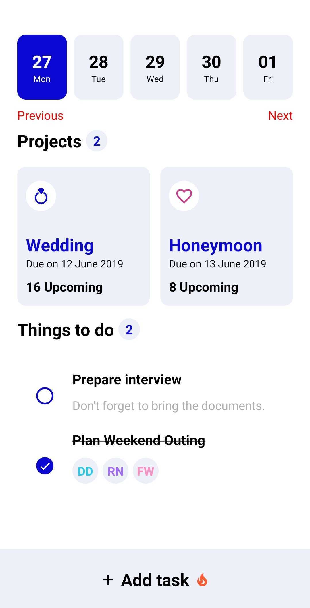
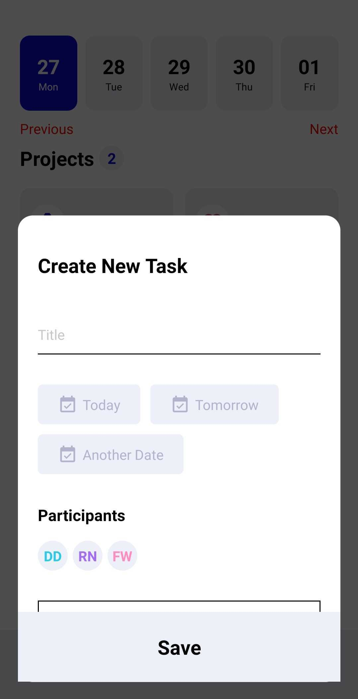
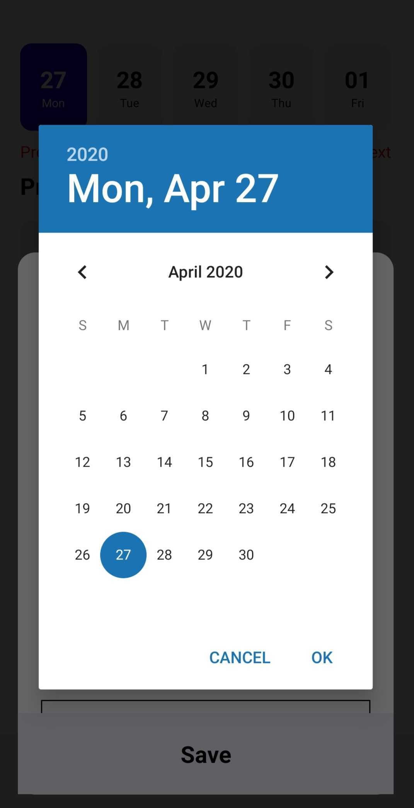
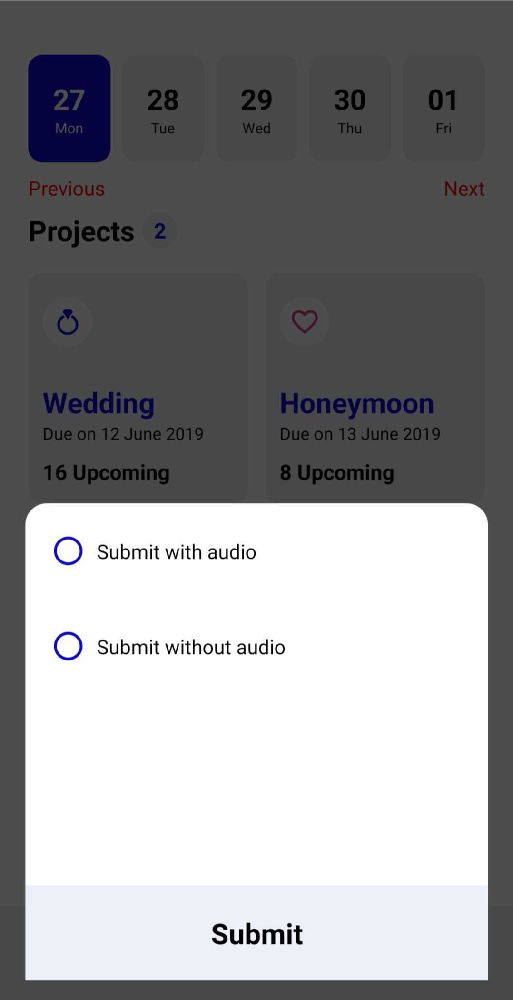
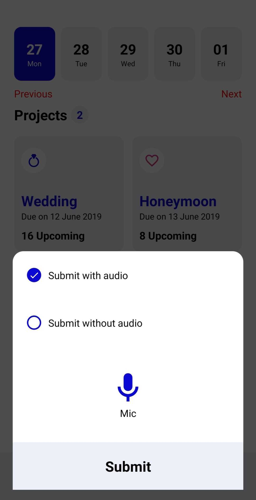
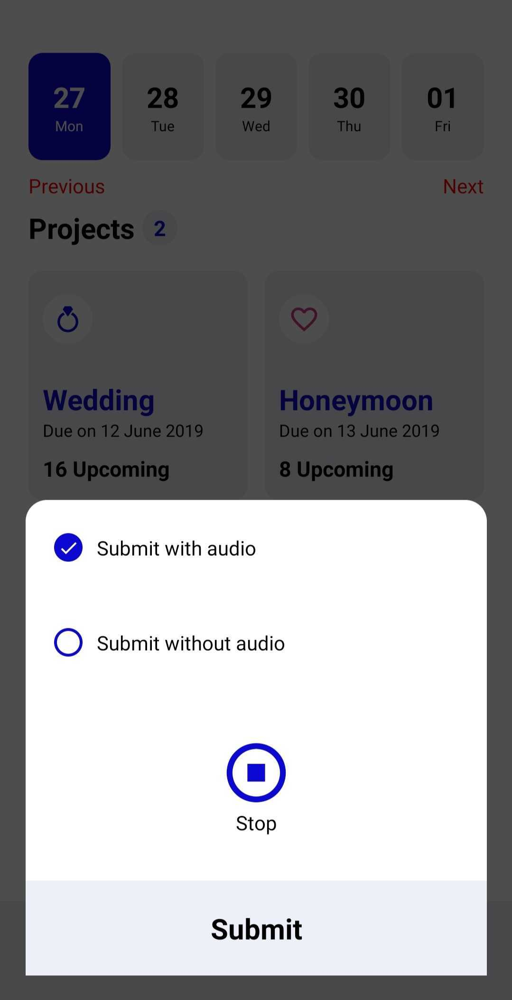
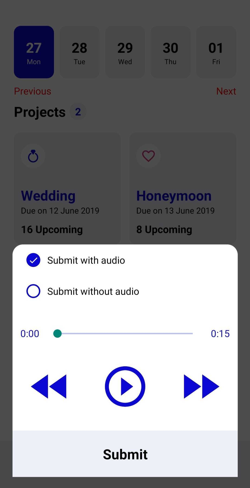
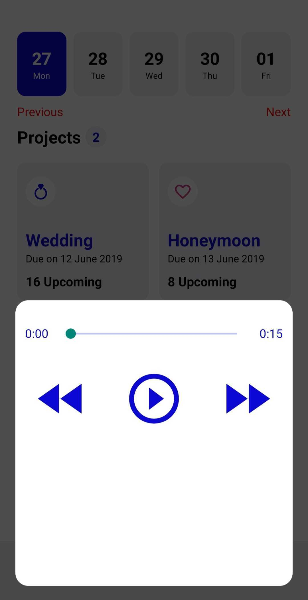

# TODO
​
### Description
​
Todo app is to make todo list and can mark task complete with audio recording.
​
### Features!
​
- Create todo list.
- Check or uncheck todo task.
- Record audio when check todo task as complete.
- Play recorded audio of previously complete task.
​
### Screenshots
​









​
### Prerequisites
​
For execution or building the project there are following tools which is required by project are mentioned below:
​
- [Git] - This will be used to clone the project
- [Node] - Please install node version above v8+.
  or
- [Yarn] - Please install yarn latest version.
​
## Clone the repository to your local machine:
​
    git clone https://github.com/pankajagrawaltw/todo_app.git
​
NPM:
​
sh
$ cd [ROOT_FOLDER]
$ npm install
​
Yarn:
​
sh
$ cd [ROOT_FOLDER]
$ yarn install
​
### Development
​
Open your node Terminal and run these commands.
​
Once the installation is completed please write the following command mentioned below:
​
NPM:
​
sh
$ cd [ROOT_FOLDER]
$ npm start
```
​
yarn:
​
sh
$ cd [ROOT_FOLDER]
$ yarn start
